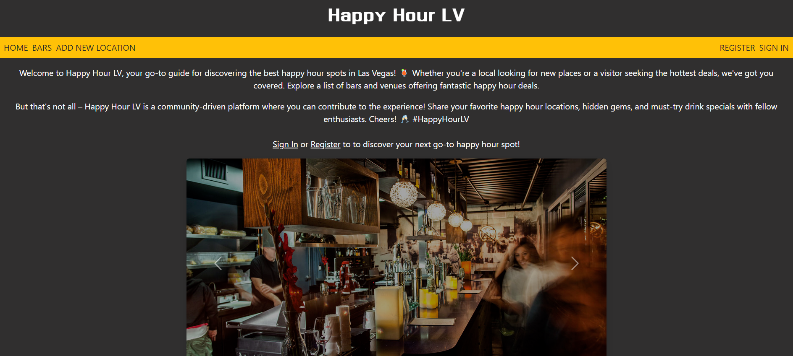

# Happy Hour LV

## Description
A go-to guide for discovering the best happy hour spots in Las Vegas. Happy Hour LV is a community-driven platform where you can contribute your favorite happy hour locations, hidden gems, and must-try drink specials with other users. The web application utlizes Node.js, Mongoose, Express, and EJS.

## Table of Contents
* [Technologies Used](#technologiesused)
* [Design](#design)
* [Functionality](#functionality)
* [Project Next Steps](#nextsteps)
* [Deployed App](#deployment)
* [About the Author](#author)

## Technologies Used
* Node.js
* Mongoose
* Express
* EJS
* JavaScript
* CSS
* BootStrap

## Whiteboard Images
*Original wireframe layout

## Design
* Design elements implemented using EJS and BootStrap/CSS. 

## Functionality
* Can create own login
* Create new locations with details on location, hours, etc.
* Users are able to edit details of locations
* Users can delete locations

## Project Next Steps
* Users will be able to only delete and edit their own posts
* Create other models such as breweries, restuarants, etc.
* Implement Google Maps so that users can find the locaton on a map

## Deployed Link
[Happy Hour LV](https://happy-hour-lv.onrender.com/)

* You can view the repository:
[Github.com](https://github.com/mherrera491/CRUDApp)
* If unable to view please go live locally through VS Code
    
## Works Cited:
* N/A

## About The Author
I am a software engineer who excels at analyzing problems and coming up with creative and effective solutions. As a team leader or an independent worker I believe in collaborating to break down intricate problems to come up with effective solutions. I can build a website, fix code, and help brands improve their overall business.
